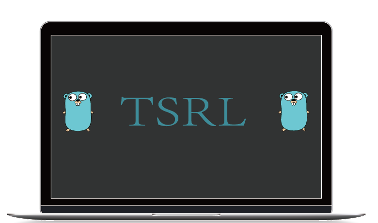
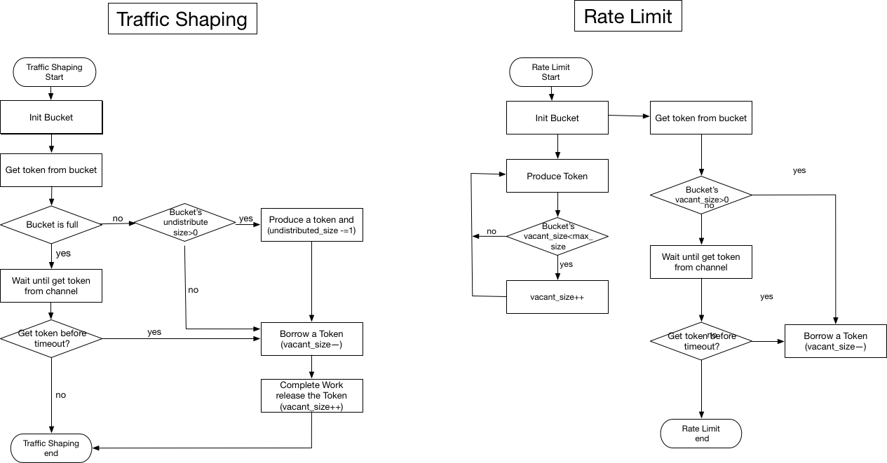

## TSRL

 it contains two types bucket  : traffic shaping and rate limit.


### Tsrl flow



### How to use
```
  // first access a new buckets pool which manage the buckets

  pool := New()
  // get a bucket ,if not exists ,program will create a new bucket ,put it into pool and return

  bucket := pool.AddBucket("hello", 500, 5*time.Second,model.BUCKET_TYPE_TRAFFIC_SHAPING)

  // get the token from bucket and do the job you need to do

  token, err := bucket.BorrowToken("key")

  // when finish your job ,you should release the token

  bucket.ReleaseToken(token)

```
